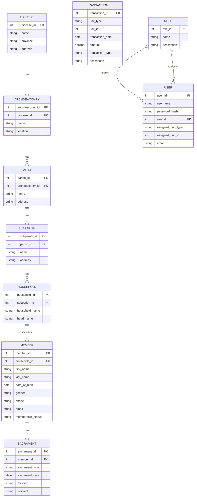

# Conceptual Design: ER Model for CoU-MIS

This file contains the real ER diagram logic for the Church of Uganda MIS, with entities, attributes, and relationships.

## Entities and Attributes

- **Diocese**
  - `diocese_id` (PK)
  - `name`
  - `province`
  - `address`

- **Archdeaconry**
  - `archdeaconry_id` (PK)
  - `diocese_id` (FK)
  - `name`
  - `location`

- **Parish**
  - `parish_id` (PK)
  - `archdeaconry_id` (FK)
  - `name`
  - `address`

- **SubParish**
  - `subparish_id` (PK)
  - `parish_id` (FK)
  - `name`
  - `address`

- **Household**
  - `household_id` (PK)
  - `subparish_id` (FK)
  - `household_name`
  - `head_name`

- **Member**
  - `member_id` (PK)
  - `household_id` (FK)
  - `first_name`
  - `last_name`
  - `date_of_birth`
  - `gender`
  - `phone`
  - `email`
  - `membership_status`

- **Sacrament**
  - `sacrament_id` (PK)
  - `member_id` (FK)
  - `sacrament_type`
  - `sacrament_date`
  - `location`
  - `officiant`

- **Transaction**
  - `transaction_id` (PK)
  - `unit_type`
  - `unit_id`
  - `transaction_date`
  - `amount`
  - `transaction_type`
  - `description`

- **Role**
  - `role_id` (PK)
  - `name`
  - `description`

- **User**
  - `user_id` (PK)
  - `username`
  - `password_hash`
  - `role_id` (FK)
  - `assigned_unit_type`
  - `assigned_unit_id`
  - `email`

## Relationships

- Diocese 1..* Archdeaconry
- Archdeaconry 1..* Parish
- Parish 1..* SubParish
- SubParish 1..* Household
- Household 1..* Member
- Member 1..* Sacrament
- Unit (Diocese/Archdeaconry/Parish/SubParish) 1..* Transaction
- Role 1..* User

## ER Diagram (Mermaid)

## Notes

- `Transaction` is intentionally flexible using `unit_type` and `unit_id` so it can reference different levels of church administration.
- The hierarchy supports roll-up reporting from SubParish up to Diocese.
- `User` records contain both role and assigned unit information for access control mapping.
